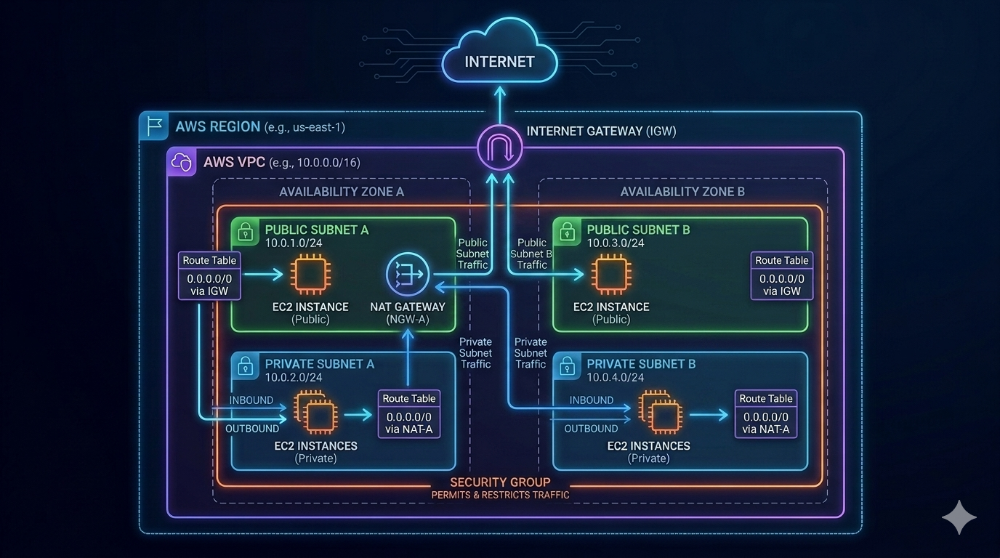

# terraform-aws-network-ch

Terraform module to create a VPC and other corresponding networking components. The default is to create a fully private VPC with no outbound Internet connectivity.

## Requirements

| Name | Version |
| ---- | ------- |
|  [terraform](#requirement\_terraform) | >= 1.6 |
|  [aws](#requirement\_aws) | >= 5.0 |

## Providers

| Name | Version |
| ---- | ------- |
|  [aws](#provider\_aws) | >= 5.0 |

## Modules

No modules.

## Resources

| Name | Type |
| ---- | ---- |
| [aws_cloudwatch_log_group.flow_logs](https://registry.terraform.io/providers/hashicorp/aws/latest/docs/resources/cloudwatch_log_group) | resource |
| [aws_default_security_group.default](https://registry.terraform.io/providers/hashicorp/aws/latest/docs/resources/default_security_group) | resource |
| [aws_eip.eip](https://registry.terraform.io/providers/hashicorp/aws/latest/docs/resources/eip) | resource |
| [aws_flow_log.flow_logs](https://registry.terraform.io/providers/hashicorp/aws/latest/docs/resources/flow_log) | resource |
| [aws_iam_role.flow_logs](https://registry.terraform.io/providers/hashicorp/aws/latest/docs/resources/iam_role) | resource |
| [aws_iam_role_policy.flow_logs](https://registry.terraform.io/providers/hashicorp/aws/latest/docs/resources/iam_role_policy) | resource |
| [aws_internet_gateway.igw](https://registry.terraform.io/providers/hashicorp/aws/latest/docs/resources/internet_gateway) | resource |
| [aws_nat_gateway.nat_gw](https://registry.terraform.io/providers/hashicorp/aws/latest/docs/resources/nat_gateway) | resource |
| [aws_route.private](https://registry.terraform.io/providers/hashicorp/aws/latest/docs/resources/route) | resource |
| [aws_route.public](https://registry.terraform.io/providers/hashicorp/aws/latest/docs/resources/route) | resource |
| [aws_route_table.private](https://registry.terraform.io/providers/hashicorp/aws/latest/docs/resources/route_table) | resource |
| [aws_route_table.public](https://registry.terraform.io/providers/hashicorp/aws/latest/docs/resources/route_table) | resource |
| [aws_route_table_association.private](https://registry.terraform.io/providers/hashicorp/aws/latest/docs/resources/route_table_association) | resource |
| [aws_route_table_association.public_1](https://registry.terraform.io/providers/hashicorp/aws/latest/docs/resources/route_table_association) | resource |
| [aws_route_table_association.public_2](https://registry.terraform.io/providers/hashicorp/aws/latest/docs/resources/route_table_association) | resource |
| [aws_subnet.private](https://registry.terraform.io/providers/hashicorp/aws/latest/docs/resources/subnet) | resource |
| [aws_subnet.public_1](https://registry.terraform.io/providers/hashicorp/aws/latest/docs/resources/subnet) | resource |
| [aws_subnet.public_2](https://registry.terraform.io/providers/hashicorp/aws/latest/docs/resources/subnet) | resource |
| [aws_vpc.vpc](https://registry.terraform.io/providers/hashicorp/aws/latest/docs/resources/vpc) | resource |
| [aws_iam_policy_document.assume_role](https://registry.terraform.io/providers/hashicorp/aws/latest/docs/data-sources/iam_policy_document) | data source |
| [aws_iam_policy_document.flow_logs](https://registry.terraform.io/providers/hashicorp/aws/latest/docs/data-sources/iam_policy_document) | data source |

## Inputs

| Name | Description | Type | Default | Required |
| ---- | ----------- | ---- | ------- | :------: |
|  [application\_name](#input\_application\_name) | Application name. | `string` | `"aws_network"` | no |
|  [enable\_internet\_connectivity](#input\_enable\_internet\_connectivity) | Enable Internet connectivity for the VPC. | `bool` | `false` | no |
|  [nat\_availability\_mode](#input\_nat\_availability\_mode) | NAT Gateway Availability Mode. Can be 'zonal' or 'regional'. | `string` | `"regional"` | no |
|  [subnet\_public\_1\_az](#input\_subnet\_public\_1\_az) | Public Subnet 1 Availability Zone. | `string` | `"us-east-1a"` | no |
|  [subnet\_public\_1\_cidr](#input\_subnet\_public\_1\_cidr) | Public Subnet 1 CIDR range. | `string` | `null` | no |
|  [subnet\_public\_2\_az](#input\_subnet\_public\_2\_az) | Public Subnet 2 Availability Zone. | `string` | `"us-east-1b"` | no |
|  [subnet\_public\_2\_cidr](#input\_subnet\_public\_2\_cidr) | Public Subnet 2 CIDR range. | `string` | `null` | no |
|  [subnets\_private](#input\_subnets\_private) | Map of private subnets with their CIDR ranges and availability zones. | <pre>map(object({     cidr = string     az   = string   }))</pre> | <pre>{   "subnet_private_1": {     "az": "us-east-1a",     "cidr": "10.0.0.0/25"   },   "subnet_private_2": {     "az": "us-east-1b",     "cidr": "10.0.0.128/25"   } }</pre> | no |
|  [vpc\_cidr](#input\_vpc\_cidr) | VPC CIDR range. | `string` | `"10.0.0.0/24"` | no |

## Outputs

| Name | Description |
| ---- | ----------- |
|  [private\_subnets](#output\_private\_subnets) | Private Subnet IDs. |
|  [public\_subnet\_1](#output\_public\_subnet\_1) | Public Subnet 1 ID. |
|  [public\_subnet\_2](#output\_public\_subnet\_2) | Public Subnet 2 ID. |
|  [vpc\_id](#output\_vpc\_id) | VPC ID. |
